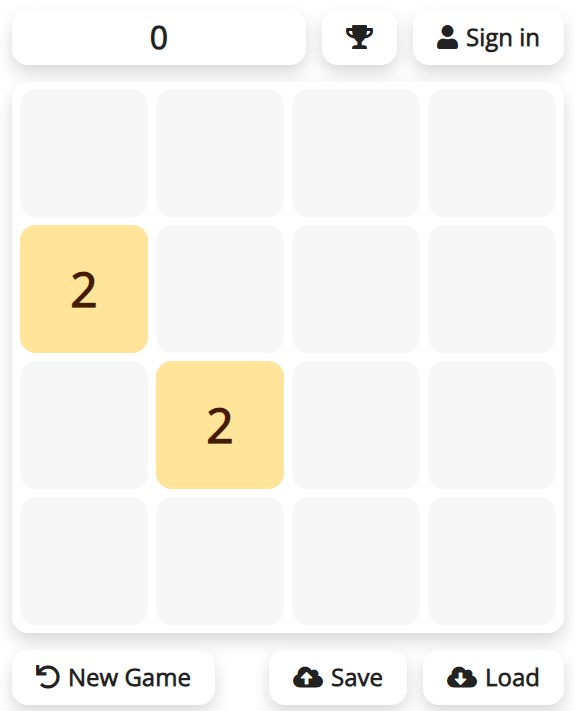

# React 2048 Game

This is a clone of the [2048](https://en.wikipedia.org/wiki/2048_(video_game)) game developed in React as a web app, with additional features: signup/signin, additional board sizes (5x5 and 6x6), leaderboards, save and load games. 



## Quick Start

This web app can be deployed locally with [Docker](https://www.docker.com/products/docker-desktop). With Docker engine running, run the following Docker CLI command in the project directory:

  `docker-compose up --build -d`

The web app is listening on port 8001: [localhost:8001](http://localhost:8001)

## Manual Deploy

Though deploying with Docker is recommended, this project can also be deployed manually. 

1. Setup Apache HTTP Server, PHP, and MySQL
2. Setup the MySQL database by running `./db/init.sql`
3. Copy the following directories and file to `/var/www/html`

   * `/css`
   * `/js`
   * `/api`
   * `/img`
   * `/index.html`

## Modification 

Refer to [React.js](https://react.dev/) for library documentations.

Setup [npm](https://www.npmjs.com/), run `npm install` to install dependencies, run `npm run build` after changes are made to the frontend code.

After any modification to the web app, the container needs to be re-built:
  1. First, stop and remove the previous expense-tracker project from Docker
  2. Run `docker-compose up --build -d`

By default, access to the MySQL database is exposed at port 82; this can be disabled by removing the following section from `docker-compose.yml`:
  ```
      ports:
        - '82:3306'
  ```
Remember to rebuild the Docker project after this change.

## License 

This project is licensed under the MIT License - see the [LICENSE](LICENSE) file for details.
